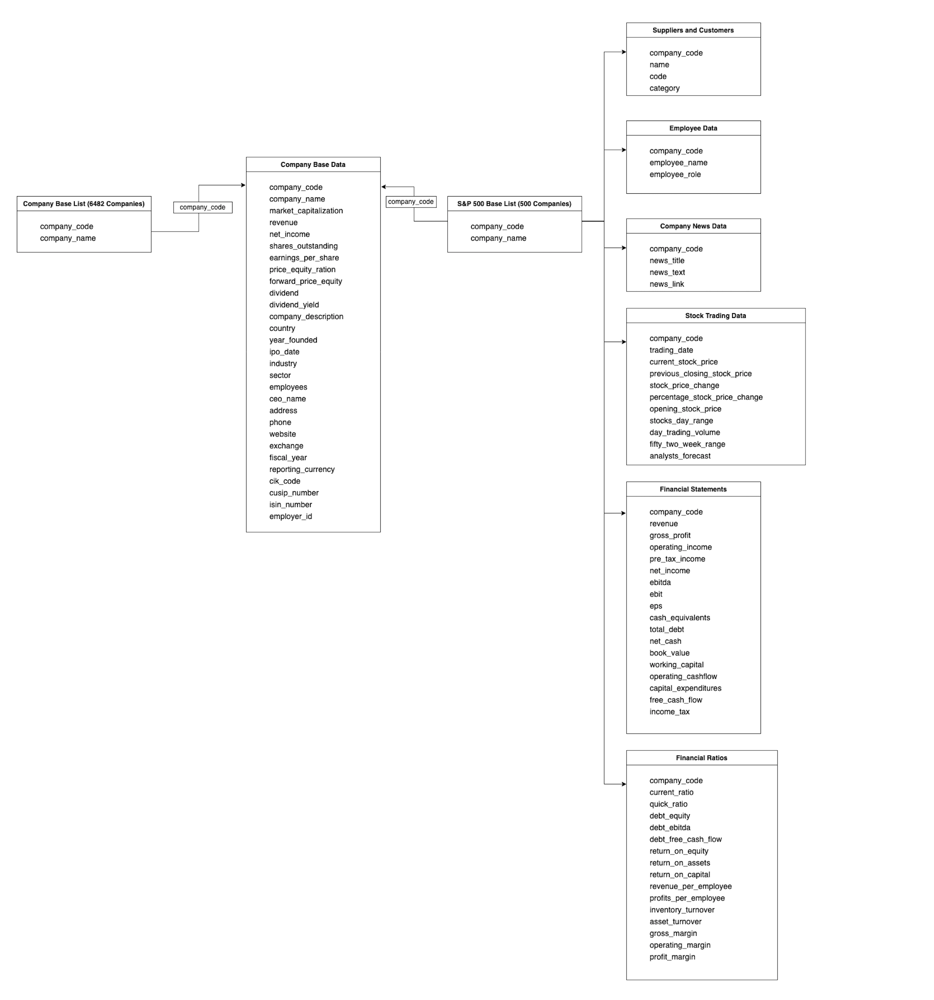

# Data Archeology & Pipeline Ingestion of Company Data for KPMG Signal Repository

### Description

A Data ingestion pipeline for company centric data from multiple sources into KPMG signals repository

6482 Companies base information available

- Company base Data that includes general information about the company, market cap, description, etc. (see SR Ingestion Metadata)

Granular data available for S&P 500 companies

- Financial Ratios
- Financial Statements
- Company News and Announcements
- Trading Data
- Key Employees Data
- Customers and Suppliers Data


### Built with:

- Python
- Beautiful Soup
- See full list of dependencies in requirements.txt

### How to Run:

- clone the repository

  ```
  git clone <repor>

  ```

- cd projectname/

- Create a virtual environment

  ```
  python3.8 -m venv env
  ```

- Activate the virtual environment

  ```
  source env/bin/activate
  ```

- Install the requirements

  ```
  pip install -r requirements.txt
  ```

- Run the base data scrapper

  ```
  python base_data.py
  ```

  NOTE: The base data scrapper is saved in tmp/international_company_data, you will have to make a copy of data already available to avoid apending duplicates.

- Run the recurring data scrapper

  ```
  python recurring_data.py
  ```

  NOTE: The recurring data scrapper can be run on a daily basis to fetch new information like news, and trading data.

### Data Architecture & Schemas



## Author

[Stephen Sanwo](https://github.com/stephensanwo)
